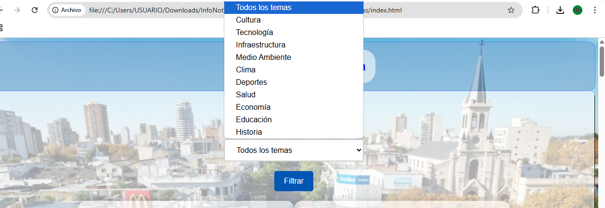
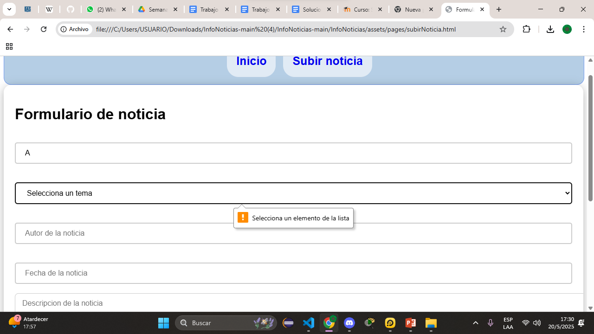
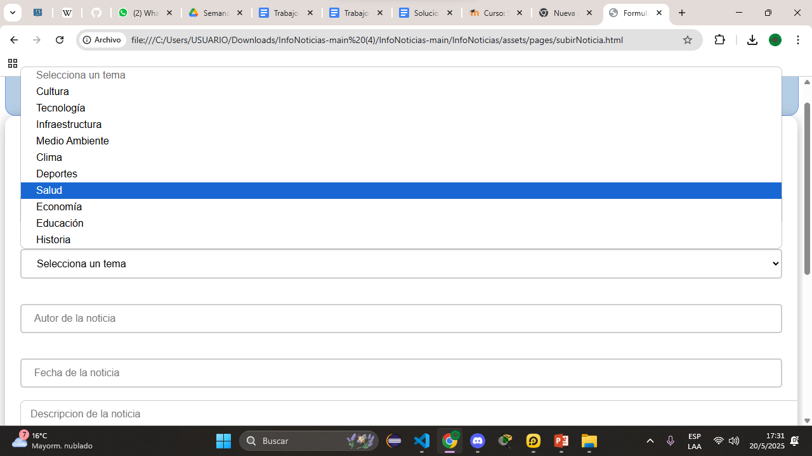
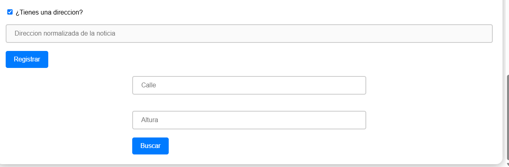
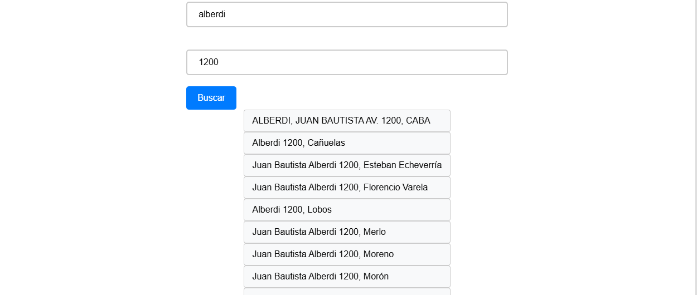
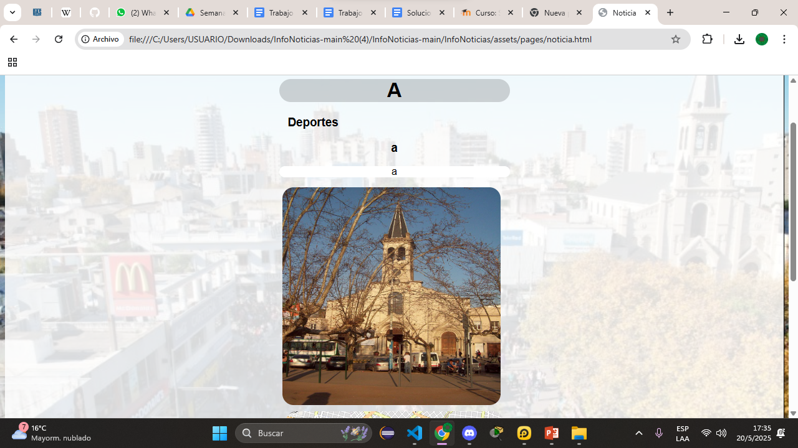

# InfoNoticias

*Portal de noticias*

*Subir Noticia*

*Noticia subida*

## Descripción
Prototipo de portal web de noticias, con funciones de interacción con lectores, redacción y publicacion de noticias, integración con servicios de normalización de direcciones, y filtrado de noticias por categoria.

## Ejecución
No se requiere disponer de un liveserver para ver la pagina. Basta con abrir el archivo index.html en su navegador web de preferencia.

## Autores
Leandro Pagnat,
Leandro Alegre,
Dante Melhado
