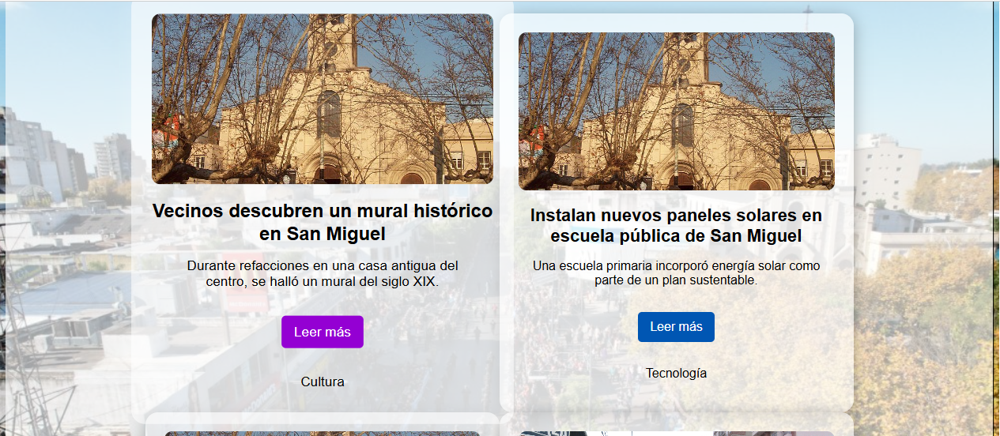

# InfoNoticias

*Portal de noticias*

*Menu Inicial*

*Card ampliada*

*Listado de filtros*

*Subir Noticia*

*Aviso de campo incompleto*

*Selector de tema de noticia*

*Ingreso de direccion*

*Noticia subida*

## Descripción
Prototipo de portal web de noticias. El proyecto cuenta con funciones de interacción con lectores, redacción y publicacion de noticias, integración con servicios de normalización de direcciones y visualizador de mapa, y filtrado de noticias por tema.

## Ejecución
No se requiere disponer de un liveserver para ver la pagina. Basta con abrir el archivo index.html en su navegador web de preferencia.

## Codigo

## Autores
Leandro Pagnat,
Leandro Alegre,
Dante Melhado
