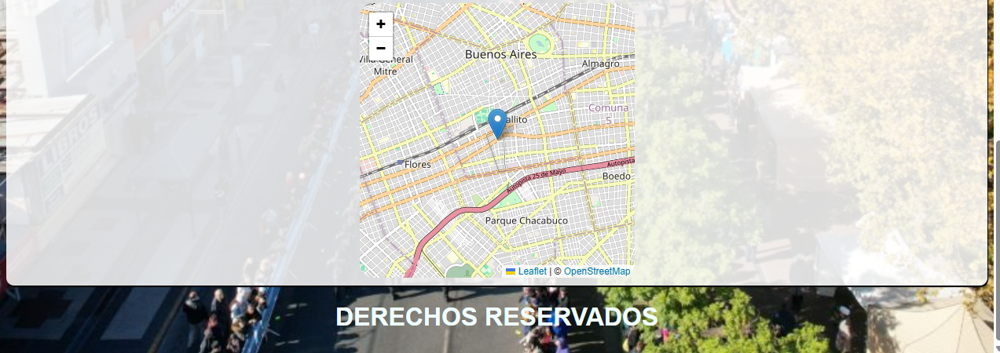

# InfoNoticias

*Portal de noticias*

*Menu Inicial*

*Card ampliada*

*Listado de filtros*

*Subir Noticia*

*Aviso de campo incompleto*

*Selector de tema de noticia*

*Ingreso de direccion*

*Noticia subida*

## Descripción
Prototipo de portal web de noticias. El proyecto cuenta con funciones de interacción con lectores, redacción y publicacion de noticias, integración con servicios de normalización de direcciones y visualizador de mapa, y filtrado de noticias por tema. Simula la experiencia de lectura y redacción de noticias en línea.

## Ejecución
No se requiere disponer de un liveserver para ver la pagina. Basta con abrir el archivo index.html en su navegador web de preferencia.

## Codigo
El codigo se organizo en las siguientes secciones para separar los estilos de los scripts:

Página principal: index.html

Subpáginas: noticia.html, subirNoticia.html

Estilos en CSS: card.css, formulario.css, nav.css, noticia.css, noticias.css.

Recursos gráficos: múltiples imágenes PNG y JPG en recusos y recusos/imagenes

---

## 1. Página de Inicio (`index.html`)
- Presenta una vista general del portal.
- Contiene el menú principal de navegación.
- Muestra noticias destacadas o recientes en tarjetas visuales (cards).

---

## 2. Visualización de Noticias (`assets/pages/noticia.html`)
- Página dedicada a mostrar el contenido completo de una noticia.
- Incluye título, imagen, cuerpo del texto y metadatos (autor, categoría, fecha).

---

## 3. Subida de Noticias (`assets/pages/subirNoticia.html`)
- Formulario para que redactores publiquen nuevas noticias.
- Campos: título, contenido, categoría, dirección normalizada (optativo), imagen.

---

## 4. Navegación y Estética
- Archivos CSS personalizados:
  - nav.css: estilo del menú de navegación.
  - noticias.css y noticia.css: diseño de noticias de muestra y página de noticias .
  - card.css: diseño de tarjetas de presentación de noticias.
  - formulario.css: estilo para el formulario de subida de noticias.

---

## 5. Carpeta Resources
- Imágenes de ejemplo para mostrar el aspecto de cada sección del sitio.
- Recursos de interfaz como formularios, tarjetas, menú y vista individual de noticias.

---

## 6. Filtrado y Categorías (Prototipo)
- Simulación de filtros por tema/categoría mediante selección visual.

---

## 7. Normalización de Direcciones
- Formularios e interfaces gráficas que representan una integración con APIs de geolocalización o normalización de direcciones.

---

## Autores
Leandro Pagnat,
Leandro Alegre,
Dante Melhado
